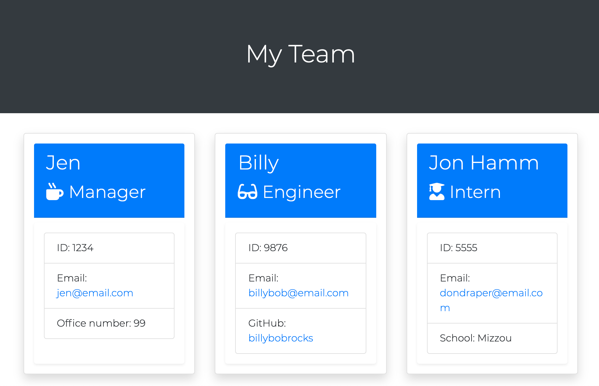
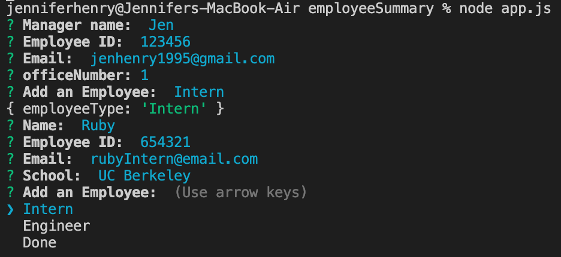

# Employee Team Generator


## Installation

GitHub: https://github.com/jenryhennifer/employeeSummary

Sample Video:  https://www.youtube.com/watch?v=GvJ9kiWJXzQ


<hr />


## Technologies

* JavaScript
* npm
    * inquirer
* Node.js
* TDD
* HTML
* GitLab 
* Github

<hr />

## Sample



<hr />

## Description

The purpose of this project was to build a software engineering team generator. This app will prompt the user for information about the manager, then proceed to give 3 options to add an employee: Intern, Engineer, Done. The user can add as many interns or engineers as they please, but when 'Done' is chosen it will render an HTML file presenting all the infomration given. 

Four classes were made to develop this app: Employee, Manager, Intern, and Engineer. They all used a similar format with constructors and calls. The difference between Employee and the remaining classes is that Employee is the parent class. Eacdh call to require Employee's module to access the constructors of the parent class. See code below:

```
const Employee = require("./Employee");

class Intern extends Employee {
    constructor(name, id, email, school) {
        super(name, id, email);
        this.school = school;
    }
    getSchool() {
        return this.school;
    }
    getRole() {
        return "Intern";
    }

}

module.exports = Intern;
```

A package from NPM was used called Inquirer to allow prompts for the user to complete within the terminal. 



Each prompt is given a validation to ensure the user gives a valid input:
```
validate: function (name) {
    if (name.length <= 0) {
        return 'Must provide input';
    }
    return true;
}
```
When the user is asked for an email there is another validation given:
```
    validate: function (email) {
    valid = /^\w+([\.-]?\w+)*@\w+([\.-]?\w+)*(\.\w{2,3})+$/.test(email)

    if (valid) {
        return true;
    } else {
        return "Please enter a valid email";
    }
}
```


<hr />

## License

MIT License

Copyright (c) 2020 Jennifer Henry

Permission is hereby granted, free of charge, to any person obtaining a copy of this software and associated documentation files (the "Software"), to deal in the Software without restriction, including without limitation the rights to use, copy, modify, merge, publish, distribute, sublicense, and/or sell copies of the Software, and to permit persons to whom the Software is furnished to do so, subject to the following conditions:

The above copyright notice and this permission notice shall be included in all copies or substantial portions of the Software.

THE SOFTWARE IS PROVIDED "AS IS", WITHOUT WARRANTY OF ANY KIND, EXPRESS OR IMPLIED, INCLUDING BUT NOT LIMITED TO THE WARRANTIES OF MERCHANTABILITY, FITNESS FOR A PARTICULAR PURPOSE AND NONINFRINGEMENT. IN NO EVENT SHALL THE AUTHORS OR COPYRIGHT HOLDERS BE LIABLE FOR ANY CLAIM, DAMAGES OR OTHER LIABILITY, WHETHER IN AN ACTION OF CONTRACT, TORT OR OTHERWISE, ARISING FROM, OUT OF OR IN CONNECTION WITH THE SOFTWARE OR THE USE OR OTHER DEALINGS IN THE SOFTWARE.

<hr />
<hr />

# Author

Jennifer Henry

* [LinkedIn](https://www.linkedin.com/in/jennifer-henry-4a540a149/)
* [GitHub](https://github.com/jenryhennifer)
* jenhenry1995@gmail.com
